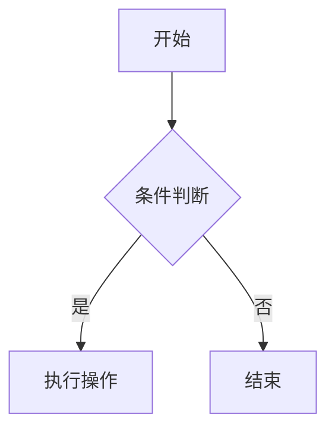
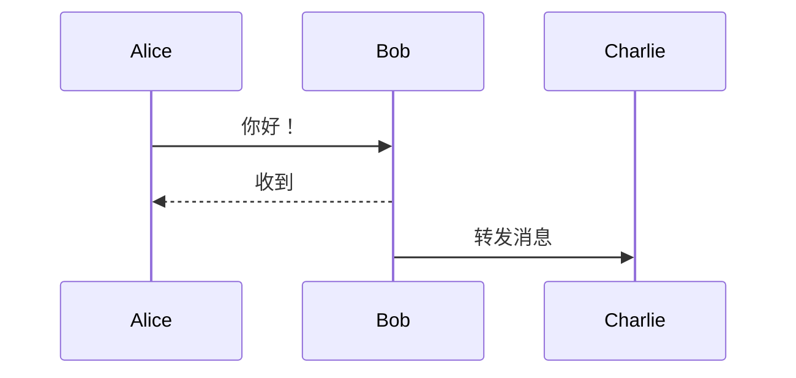
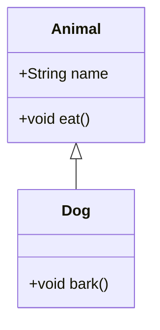
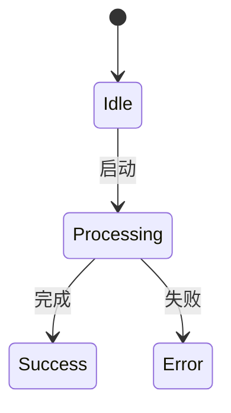
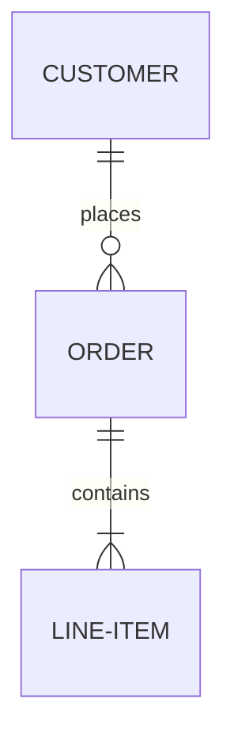
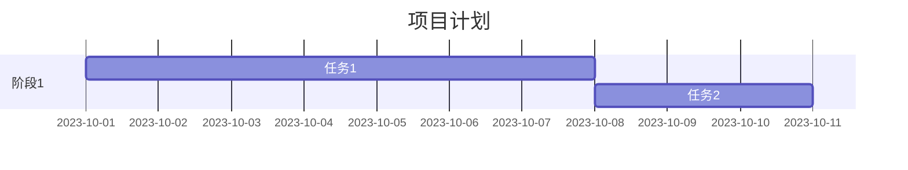
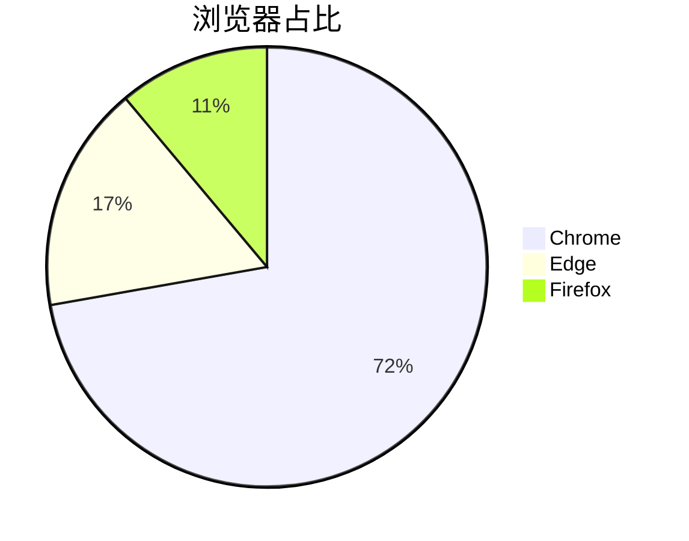
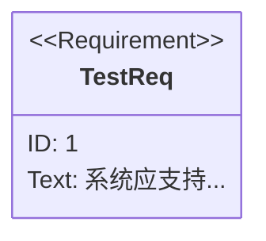

## Mermaid 

> 是一个强大的文本生成图表工具，支持多种图表类型。

### 流程图

```mermaid
flowchart TD
    A[开始] --> B{条件判断}
    B -->|是| C[执行操作]
    B -->|否| D[结束]
```

### 序列图

```mermaid
sequenceDiagram
    Alice->>Bob: 你好！
    Bob-->>Alice: 收到
    Bob->>Charlie: 转发消息
```

### 类图

```mermaid
classDiagram
    class Animal {
        +String name
        +void eat()
    }
    class Dog {
        +void bark()
    }
    Animal <|-- Dog
```

### 状态图

```mermaid
stateDiagram-v2
    [*] --> Idle
    Idle --> Processing : 启动
    Processing --> Success : 完成
    Processing --> Error : 失败
```

### 实体关系图

```mermaid
erDiagram
    CUSTOMER ||--o{ ORDER : places
    ORDER ||--|{ LINE-ITEM : contains
```

### 甘特图

```mermaid
gantt
    title 项目计划
    section 阶段1
    任务1 :a1, 2023-10-01, 7d
    任务2 :after a1, 3d
```

### 饼图

```mermaid
pie
    title 浏览器占比
    "Chrome" : 65
    "Edge" : 15
    "Firefox" : 10
```

### 需求图

```mermaid
requirementDiagram
    requirement TestReq {
        id: 1
        text: "系统应支持..."
    }
```

