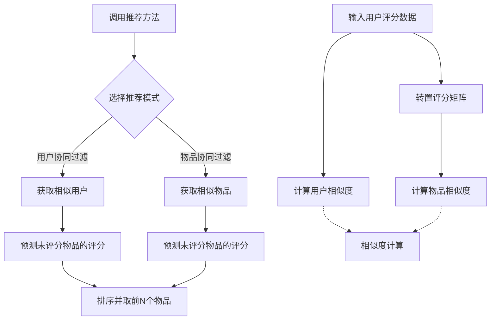
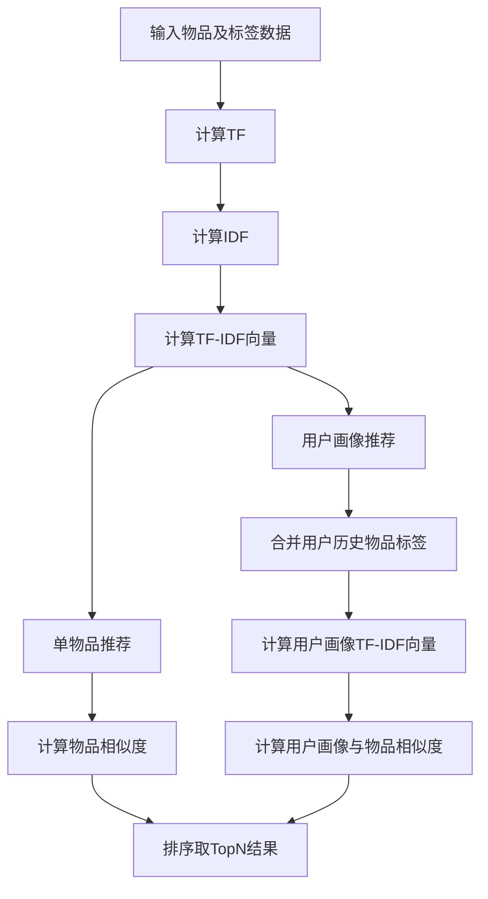
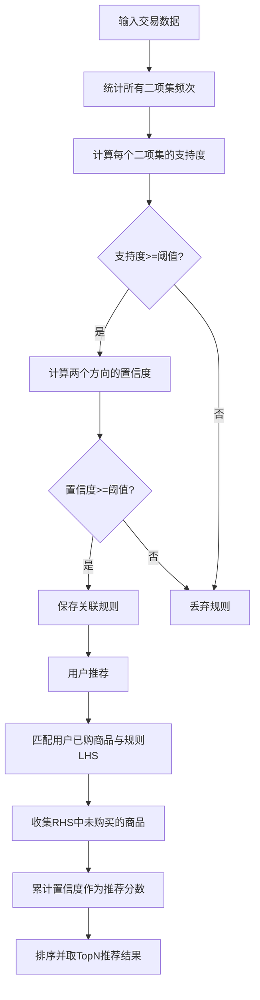

# 常用算法封装

## 方向1

### 1. 推荐算法类

| 算法                                          | 适用场景                   | 特点                                                         |
| --------------------------------------------- | -------------------------- | ------------------------------------------------------------ |
| **基于内容的推荐（Content-Based Filtering）** | 商品/文章/电影等有详细属性 | 直接根据物品的标签、关键词、类别等做相似度推荐，解决冷启动问题 |
| **基于规则的推荐**                            | 业务规则固定               | 比如销量前N、评分最高N、最近浏览过的类似商品                 |
| **基于关联规则（Apriori/FP-Growth）**         | 电商、购物车               | 分析“买了A的人也买了B”                                       |
| **基于图的推荐（Graph-based）**               | 社交、知识图谱             | 用物品-用户的关系图计算物品间关联                            |
| **协同过滤（Collaborative Filtering）**       | 用户-物品评分或行为数据    | 基于用户相似度（UserCF）或物品相似度（ItemCF）推荐，易受冷启动影响 |
| **矩阵分解（SVD/SVD++）**                     | 用户-物品评分矩阵          | 比协同过滤更高阶，可捕捉潜在特征                             |
| **深度学习推荐（DeepFM、YouTube DNN 推荐）**  | 用户数据大                 | 适合做个亮点展示，复杂度高                                   |


### 2. 个性化排序/打分类

即使推荐结果相同，也可以通过排序优化个性化效果：

- **学习排序（Learning to Rank）**：比如用 `XGBoost` / `LightGBM` 排序模型
- **多因素加权**：比如 `(协同过滤得分 × 0.6) + (物品热度 × 0.4)`

## 协同过滤

1. **基于用户的协同过滤（User-Based CF）**
   - 根据用户之间的相似度，找出与目标用户兴趣最相似的其他用户。
   - 根据这些相似用户的评分预测目标用户可能喜欢的物品。
2. **基于物品的协同过滤（Item-Based CF）**
   - 根据物品之间的相似度，找出与用户已评分物品相似的其他物品。
   - 通过相似物品的加权评分预测用户可能感兴趣的物品。

**主要流程**：

1. **数据初始化**
   - 构造函数接收 `ratings`（用户 → 物品 → 评分）数据。
   - 计算所有用户之间的相似度（用于 User-Based CF）。
   - 转置评分矩阵，计算物品之间的相似度（用于 Item-Based CF）。
2. **推荐计算**
   - **User-Based CF**：从相似用户中收集未评分物品 → 计算加权预测分 → 排序取前 N 个。
   - **Item-Based CF**：从已评分物品的相似物品中收集未评分物品 → 计算加权预测分 → 排序取前 N 个。
3. **余弦相似度计算**
   - 用余弦相似度公式衡量两个用户或两个物品的兴趣相似程度。




### 封装

```java
package com.base.utils;

import java.util.*;
import java.util.stream.Collectors;

public class RecommendationUtil {

    public enum RecommendationMode {
        USER_BASED,
        ITEM_BASED
    }

    private final Map<Integer, Map<Integer, Double>> ratings;
    private final Map<Integer, Map<Integer, Double>> userSimilarities;
    private final Map<Integer, Map<Integer, Double>> itemSimilarities;
    private final Map<Integer, Map<Integer, Double>> transposedRatings;


    public RecommendationUtil(Map<Integer, Map<Integer, Double>> ratings) {
        this.ratings = ratings;
        // 用于基于用户的协同过滤
        this.userSimilarities = calculateAllUserSimilarities();

        // 用于基于物品的协同过滤
        this.transposedRatings = transposeRatings();
        this.itemSimilarities = calculateAllItemSimilarities();
    }

    private Map<Integer, Map<Integer, Double>> transposeRatings() {
        Map<Integer, Map<Integer, Double>> transposed = new HashMap<>();
        for (Map.Entry<Integer, Map<Integer, Double>> userEntry : ratings.entrySet()) {
            int userId = userEntry.getKey();
            for (Map.Entry<Integer, Double> itemEntry : userEntry.getValue().entrySet()) {
                int itemId = itemEntry.getKey();
                double score = itemEntry.getValue();
                transposed.computeIfAbsent(itemId, k -> new HashMap<>()).put(userId, score);
            }
        }
        return transposed;
    }

    private Map<Integer, Map<Integer, Double>> calculateAllUserSimilarities() {
        Map<Integer, Map<Integer, Double>> similarities = new HashMap<>();
        List<Integer> userIds = new ArrayList<>(ratings.keySet());
        for (int i = 0; i < userIds.size(); i++) {
            for (int j = i; j < userIds.size(); j++) {
                int userId1 = userIds.get(i);
                int userId2 = userIds.get(j);
                if (userId1 != userId2) {
                    double sim = cosineSimilarity(ratings.get(userId1), ratings.get(userId2));
                    if (sim > 0) { // 只存储正相似度
                        similarities.computeIfAbsent(userId1, k -> new HashMap<>()).put(userId2, sim);
                        similarities.computeIfAbsent(userId2, k -> new HashMap<>()).put(userId1, sim);
                    }
                }
            }
        }
        return similarities;
    }

    private Map<Integer, Map<Integer, Double>> calculateAllItemSimilarities() {
        Map<Integer, Map<Integer, Double>> similarities = new HashMap<>();
        List<Integer> itemIds = new ArrayList<>(transposedRatings.keySet());
        for (int i = 0; i < itemIds.size(); i++) {
            for (int j = i; j < itemIds.size(); j++) {
                int itemId1 = itemIds.get(i);
                int itemId2 = itemIds.get(j);
                if (itemId1 != itemId2) {
                    double sim = cosineSimilarity(transposedRatings.get(itemId1), transposedRatings.get(itemId2));
                    if (sim > 0) { // 只存储正相似度
                        similarities.computeIfAbsent(itemId1, k -> new HashMap<>()).put(itemId2, sim);
                        similarities.computeIfAbsent(itemId2, k -> new HashMap<>()).put(itemId1, sim);
                    }
                }
            }
        }
        return similarities;
    }

    /**
     * 根据选择的模式获取推荐结果
     *
     * @param userId 用户ID
     * @param topN   返回的推荐数量
     * @param mode   推荐模式（USER_BASED 或 ITEM_BASED）
     * @return 推荐的物品ID及其预测得分列表
     */
    public List<Map.Entry<Integer, Double>> getRecommendations(int userId, int topN, RecommendationMode mode) {
        switch (mode) {
            case USER_BASED:
                return userBasedCF(userId, topN);
            case ITEM_BASED:
                return itemBasedCF(userId, topN);
            default:
                throw new IllegalArgumentException("无效的推荐模式");
        }
    }

    private List<Map.Entry<Integer, Double>> userBasedCF(int userId, int topN) {
        // 1. 获取当前用户的相似用户
        Map<Integer, Double> currentUserSimilarities = userSimilarities.getOrDefault(userId, Collections.emptyMap());

        // 2. 根据相似用户预测未评分物品的评分
        Map<Integer, Double> scorePredictions = new HashMap<>();
        Map<Integer, Double> weightedSumOfSimilarities = new HashMap<>();

        for (Map.Entry<Integer, Double> simEntry : currentUserSimilarities.entrySet()) {
            Integer otherUserId = simEntry.getKey();
            double similarity = simEntry.getValue();

            for (Map.Entry<Integer, Double> itemEntry : ratings.get(otherUserId).entrySet()) {
                Integer itemId = itemEntry.getKey();
                // 只推荐用户没有评分过的物品
                if (!ratings.get(userId).containsKey(itemId)) {
                    scorePredictions.merge(itemId, similarity * itemEntry.getValue(), Double::sum);
                    weightedSumOfSimilarities.merge(itemId, similarity, Double::sum);
                }
            }
        }

        // 归一化评分
        Map<Integer, Double> normalizedScorePredictions = new HashMap<>();
        for(Map.Entry<Integer, Double> entry : scorePredictions.entrySet()){
            int itemId = entry.getKey();
            double totalSimilarity = weightedSumOfSimilarities.get(itemId);
            if(totalSimilarity > 0){
                normalizedScorePredictions.put(itemId, entry.getValue() / totalSimilarity);
            }
        }

        // 3. 按预测分数排序并取前 N 个
        return normalizedScorePredictions.entrySet()
                .stream()
                .sorted(Map.Entry.<Integer, Double>comparingByValue().reversed())
                .limit(topN)
                .collect(Collectors.toList());
    }

    private List<Map.Entry<Integer, Double>> itemBasedCF(int userId, int topN) {
        Map<Integer, Double> userRatings = ratings.get(userId);
        Map<Integer, Double> scorePredictions = new HashMap<>();
        Map<Integer, Double> sumOfSimilarities = new HashMap<>();

        // 对用户已评分的每个物品
        for (Map.Entry<Integer, Double> ratedItemEntry : userRatings.entrySet()) {
            int ratedItemId = ratedItemEntry.getKey();
            double rating = ratedItemEntry.getValue();

            // 找到与该物品相似的其他物品
            Map<Integer, Double> similarItems = itemSimilarities.getOrDefault(ratedItemId, Collections.emptyMap());

            for (Map.Entry<Integer, Double> simEntry : similarItems.entrySet()) {
                int similarItemId = simEntry.getKey();
                double similarity = simEntry.getValue();

                // 如果用户没有对该相似物品评分
                if (!userRatings.containsKey(similarItemId)) {
                    // 累积加权得分
                    scorePredictions.merge(similarItemId, similarity * rating, Double::sum);
                    // 累积相似度
                    sumOfSimilarities.merge(similarItemId, similarity, Double::sum);
                }
            }
        }

        // 归一化评分
        Map<Integer, Double> normalizedScorePredictions = new HashMap<>();
        for (Map.Entry<Integer, Double> entry : scorePredictions.entrySet()) {
            int itemId = entry.getKey();
            double totalSimilarity = sumOfSimilarities.getOrDefault(itemId, 0.0);
            if (totalSimilarity > 0) {
                normalizedScorePredictions.put(itemId, entry.getValue() / totalSimilarity);
            }
        }

        // 排序并取前 N 个推荐
        return normalizedScorePredictions.entrySet()
                .stream()
                .sorted(Map.Entry.<Integer, Double>comparingByValue().reversed())
                .limit(topN)
                .collect(Collectors.toList());
    }


    /**
     * 计算两个向量（Map）的余弦相似度
     */
    private double cosineSimilarity(Map<Integer, Double> vec1, Map<Integer, Double> vec2) {
        double dotProduct = 0.0, normA = 0.0, normB = 0.0;

        Set<Integer> commonKeys = new HashSet<>(vec1.keySet());
        commonKeys.retainAll(vec2.keySet());

        for (Integer key : commonKeys) {
            dotProduct += vec1.get(key) * vec2.get(key);
        }

        for (double val : vec1.values()) {
            normA += Math.pow(val, 2);
        }
        for (double val : vec2.values()) {
            normB += Math.pow(val, 2);
        }

        if (normA == 0 || normB == 0) {
            return 0.0;
        }
        return dotProduct / (Math.sqrt(normA) * Math.sqrt(normB));
    }
}
```

### 调用示例

```java
package com.base.utils;

import java.util.ArrayList;
import java.util.HashMap;
import java.util.List;
import java.util.Map;

public class TestRecommendation {

    // 1. 定义数据模型，模拟数据表中的一条记录
    static class Rating {
        private final int userId;
        private final int itemId;
        private final double rating;

        public Rating(int userId, int itemId, double rating) {
            this.userId = userId;
            this.itemId = itemId;
            this.rating = rating;
        }

        public int getUserId() {
            return userId;
        }

        public int getItemId() {
            return itemId;
        }

        public double getRating() {
            return rating;
        }
    }

    // 2. 模拟从数据源（如数据库）加载数据
    public static List<Rating> loadRatingsData() {
        List<Rating> ratings = new ArrayList<>();
        ratings.add(new Rating(1, 101, 5.0));
        ratings.add(new Rating(1, 102, 3.0));
        ratings.add(new Rating(1, 103, 4.0));
        ratings.add(new Rating(2, 101, 4.0));
        ratings.add(new Rating(2, 102, 2.0));
        ratings.add(new Rating(2, 104, 5.0));
        ratings.add(new Rating(3, 101, 4.0));
        ratings.add(new Rating(3, 103, 5.0));
        ratings.add(new Rating(3, 104, 3.0));
        ratings.add(new Rating(4, 102, 4.0));
        ratings.add(new Rating(4, 105, 5.0));
        ratings.add(new Rating(4, 106, 4.5));
        ratings.add(new Rating(5, 103, 5.0));
        ratings.add(new Rating(5, 105, 4.0));
        ratings.add(new Rating(5, 107, 4.5));
        return ratings;
    }

    // 3. 将加载的数据转换为推荐引擎所需的格式
    public static Map<Integer, Map<Integer, Double>> transformToUserRatingsMap(List<Rating> ratings) {
        Map<Integer, Map<Integer, Double>> userRatings = new HashMap<>();
        for (Rating rating : ratings) {
            userRatings.computeIfAbsent(rating.getUserId(), k -> new HashMap<>())
                       .put(rating.getItemId(), rating.getRating());
        }
        return userRatings;
    }

    public static void main(String[] args) {
        // 1. 从模拟数据源加载数据
        List<Rating> ratingData = loadRatingsData();

        // 2. 将数据转换为推荐引擎所需的格式
        Map<Integer, Map<Integer, Double>> ratings = transformToUserRatingsMap(ratingData);

        // 3. 创建推荐引擎实例
        RecommendationUtil recommender = new RecommendationUtil(ratings);

        int userId = 1;
        int topN = 2;

        System.out.println("为用户 " + userId + " 推荐 " + topN + " 个物品:");

        // 1. 基于用户的协同过滤推荐
        List<Map.Entry<Integer, Double>> userBasedRecommendations = recommender.getRecommendations(userId, topN, RecommendationUtil.RecommendationMode.USER_BASED);
        System.out.println("基于用户的推荐结果 (User-Based): " + userBasedRecommendations);

        // 2. 基于物品的协同过滤推荐
        List<Map.Entry<Integer, Double>> itemBasedRecommendations = recommender.getRecommendations(userId, topN, RecommendationUtil.RecommendationMode.ITEM_BASED);
        System.out.println("基于物品的推荐结果 (Item-Based): " + itemBasedRecommendations);

        // 为另一个用户推荐
        userId = 4;
        System.out.println("\n为用户 " + userId + " 推荐 " + topN + " 个物品:");

        userBasedRecommendations = recommender.getRecommendations(userId, topN, RecommendationUtil.RecommendationMode.USER_BASED);
        System.out.println("基于用户的推荐结果 (User-Based): " + userBasedRecommendations);

        itemBasedRecommendations = recommender.getRecommendations(userId, topN, RecommendationUtil.RecommendationMode.ITEM_BASED);
        System.out.println("基于物品的推荐结果 (Item-Based): " + itemBasedRecommendations);
    }
}
```

输出如下：

```tex
为用户 1 推荐 2 个物品:

基于用户的推荐结果 (User-Based): [106=4.5, 107=4.5]
基于物品的推荐结果 (Item-Based): [104=4.2998742574479225, 107=4.0]

为用户 4 推荐 2 个物品:
基于用户的推荐结果 (User-Based): [104=5.0, 103=4.600933258255171]
基于物品的推荐结果 (Item-Based): [107=5.0, 103=4.583628681216292]
```

## 基于内容

1. **单物品内容推荐**（`recommendByContentTFIDF`）
   - 输入一个目标物品 ID，计算它与所有其他物品的相似度
   - 排序取前 N 个相似度最高的物品作为推荐结果
2. **基于用户画像推荐**（`recommendForUserProfile`）
   - 将用户历史交互过的物品的标签集合成用户画像
   - 用 TF-IDF 表示用户画像向量
   - 计算用户画像与其他物品的相似度
   - 排除用户已拥有的物品，排序取前 N 个推荐

**主要步骤**：

1. **TF 计算**：统计标签在物品中的出现频率
2. **IDF 计算**：统计标签在所有物品中出现的文档频率，计算逆文档频率
3. **TF-IDF 向量**：结合 TF 和 IDF 计算物品的内容向量
4. **余弦相似度**：衡量两个向量（物品或用户画像）之间的相似程度
5. **排序推荐**：按相似度从高到低排序，取前 N 个结果




### 封装

```java
package com.base.ContentBasedFiltering;

import java.util.*;
import java.util.stream.Collectors;

/**
 * 基于内容的推荐工具类 (TF-IDF + 余弦相似度)
 *
 * 优化说明:
 * 1. 将TF, IDF, TF-IDF的计算拆分为独立的辅助方法，提高代码复用性和可读性。
 * 2. 使用 Map<String, Double> 作为TF-IDF向量的稀疏表示，比 double[] 更节省内存。
 * 3. 新增 recommendForUserProfile 方法，用于基于用户的多个历史物品进行推荐。
 */
public class ContentBasedRecommendationUtil {

    /**
     * 基于单个目标物品，推荐最相似的TopN个其他物品。
     *
     * @param allItems     所有物品及其内容标签的Map, e.g., {101: ["Java", "后端"]}
     * @param targetItemId 目标物品ID
     * @param topN         推荐数量
     * @return 推荐的物品ID及其相似度得分列表
     */
    public static List<Map.Entry<Integer, Double>> recommendByContentTFIDF(
            Map<Integer, List<String>> allItems,
            int targetItemId,
            int topN) {

        if (!allItems.containsKey(targetItemId)) {
            throw new IllegalArgumentException("目标物品ID不存在: " + targetItemId);
        }

        // 1. 计算所有物品的TF-IDF向量
        Map<Integer, Map<String, Double>> allTfIdfVectors = calculateAllTfIdfVectors(allItems);

        // 2. 获取目标物品的向量
        Map<String, Double> targetVector = allTfIdfVectors.get(targetItemId);

        // 3. 计算目标向量与其他所有物品向量的余弦相似度
        Map<Integer, Double> similarities = new HashMap<>();
        for (Map.Entry<Integer, Map<String, Double>> entry : allTfIdfVectors.entrySet()) {
            Integer currentItemId = entry.getKey();
            // 跳过目标物品本身
            if (currentItemId.equals(targetItemId)) {
                continue;
            }
            double similarity = cosineSimilarity(targetVector, entry.getValue());
            if (similarity > 0) { // 只保留有相似度的物品
                similarities.put(currentItemId, similarity);
            }
        }

        // 4. 排序并返回TopN结果
        return similarities.entrySet().stream()
                .sorted(Map.Entry.<Integer, Double>comparingByValue().reversed())
                .limit(topN)
                .collect(Collectors.toList());
    }

    /**
     * 基于用户的一组历史物品（用户画像），推荐最符合其兴趣的TopN个新物品。
     *
     * @param allItems    所有物品及其内容标签的Map
     * @param userItemIds 用户已经交互过的物品ID列表
     * @param topN        推荐数量
     * @return 推荐的物品ID及其相似度得分列表
     */
    public static List<Map.Entry<Integer, Double>> recommendForUserProfile(
            Map<Integer, List<String>> allItems,
            List<Integer> userItemIds,
            int topN) {

        // 1. 聚合用户画像的标签
        List<String> userProfileTags = new ArrayList<>();
        for (Integer itemId : userItemIds) {
            if (allItems.containsKey(itemId)) {
                userProfileTags.addAll(allItems.get(itemId));
            }
        }

        if (userProfileTags.isEmpty()) {
            return Collections.emptyList(); // 如果用户画像为空，无法推荐
        }

        // 2. 计算所有物品的TF-IDF向量和IDF值
        Map<String, Double> idfMap = calculateIdf(allItems);
        Map<Integer, Map<String, Double>> allTfIdfVectors = calculateAllTfIdfVectors(allItems, idfMap);

        // 3. 计算用户画像的TF-IDF向量
        Map<String, Double> userProfileTf = calculateTf(userProfileTags);
        Map<String, Double> userProfileTfIdfVector = calculateTfIdf(userProfileTf, idfMap);

        // 4. 计算用户画像向量与所有其他物品向量的余弦相似度
        Map<Integer, Double> similarities = new HashMap<>();
        for (Map.Entry<Integer, Map<String, Double>> entry : allTfIdfVectors.entrySet()) {
            Integer currentItemId = entry.getKey();

            // 排除用户已经拥有的物品
            if (!userItemIds.contains(currentItemId)) {
                double similarity = cosineSimilarity(userProfileTfIdfVector, entry.getValue());
                if (similarity > 0) {
                    similarities.put(currentItemId, similarity);
                }
            }
        }

        // 5. 排序并返回TopN结果
        return similarities.entrySet().stream()
                .sorted(Map.Entry.<Integer, Double>comparingByValue().reversed())
                .limit(topN)
                .collect(Collectors.toList());
    }


    // --- 私有辅助方法 ---

    /**
     * 计算整个数据集中所有物品的TF-IDF向量
     */
    private static Map<Integer, Map<String, Double>> calculateAllTfIdfVectors(Map<Integer, List<String>> allItems) {
        Map<String, Double> idfMap = calculateIdf(allItems);
        return calculateAllTfIdfVectors(allItems, idfMap);
    }

    /**
     * 计算整个数据集中所有物品的TF-IDF向量 (重载方法，接收已计算好的IDF)
     */
    private static Map<Integer, Map<String, Double>> calculateAllTfIdfVectors(Map<Integer, List<String>> allItems, Map<String, Double> idfMap) {
        Map<Integer, Map<String, Double>> allTfIdfVectors = new HashMap<>();
        for (Map.Entry<Integer, List<String>> entry : allItems.entrySet()) {
            Map<String, Double> tf = calculateTf(entry.getValue());
            Map<String, Double> tfIdf = calculateTfIdf(tf, idfMap);
            allTfIdfVectors.put(entry.getKey(), tfIdf);
        }
        return allTfIdfVectors;
    }

    /**
     * 计算单个文档（物品）的词频 (Term Frequency)
     * @param tags 物品的标签列表
     * @return 一个Map，键是标签，值是该标签的TF值
     */
    private static Map<String, Double> calculateTf(List<String> tags) {
        Map<String, Double> tfMap = new HashMap<>();
        if (tags == null || tags.isEmpty()) {
            return tfMap;
        }
        long totalTerms = tags.size();
        // 使用Map来统计词频，比Collections.frequency更高效
        Map<String, Long> termCounts = tags.stream()
                .collect(Collectors.groupingBy(tag -> tag, Collectors.counting()));

        for (Map.Entry<String, Long> entry : termCounts.entrySet()) {
            tfMap.put(entry.getKey(), (double) entry.getValue() / totalTerms);
        }
        return tfMap;
    }

    /**
     * 计算数据集中所有词的逆文档频率 (Inverse Document Frequency)
     * @param allItems 所有物品及其标签
     * @return 一个Map，键是标签，值是该标签的IDF值
     */
    private static Map<String, Double> calculateIdf(Map<Integer, List<String>> allItems) {
        Map<String, Double> idfMap = new HashMap<>();
        int totalDocs = allItems.size();
        if (totalDocs == 0) {
            return idfMap;
        }

        // 先获取所有唯一的词
        Set<String> allUniqueTags = allItems.values().stream()
                .flatMap(List::stream)
                .collect(Collectors.toSet());

        // 计算每个词出现在多少个文档中
        for (String tag : allUniqueTags) {
            int docCount = 0;
            for (List<String> tags : allItems.values()) {
                // 使用Set进行判断，避免重复计算
                if (new HashSet<>(tags).contains(tag)) {
                    docCount++;
                }
            }
            // 加1平滑，避免分母为0
            idfMap.put(tag, Math.log((double) totalDocs / (docCount + 1.0)));
        }
        return idfMap;
    }

    /**
     * 计算TF-IDF值
     * @param tfMap 单个物品的TF Map
     * @param idfMap 整个数据集的IDF Map
     * @return 一个Map，表示该物品的TF-IDF向量
     */
    private static Map<String, Double> calculateTfIdf(Map<String, Double> tfMap, Map<String, Double> idfMap) {
        Map<String, Double> tfIdfVector = new HashMap<>();
        for (Map.Entry<String, Double> entry : tfMap.entrySet()) {
            String tag = entry.getKey();
            double tf = entry.getValue();
            double idf = idfMap.getOrDefault(tag, 0.0); // 如果IDF中没有这个词，则IDF值为0
            tfIdfVector.put(tag, tf * idf);
        }
        return tfIdfVector;
    }

    /**
     * 计算两个稀疏向量（用Map表示）的余弦相似度
     */
    private static double cosineSimilarity(Map<String, Double> vec1, Map<String, Double> vec2) {
        if (vec1 == null || vec2 == null || vec1.isEmpty() || vec2.isEmpty()) {
            return 0.0;
        }

        // 求点积
        double dotProduct = 0.0;
        // 遍历较小的map以提高效率
        Map<String, Double> smallerVec = vec1.size() < vec2.size() ? vec1 : vec2;
        Map<String, Double> largerVec = vec1.size() < vec2.size() ? vec2 : vec1;

        for (Map.Entry<String, Double> entry : smallerVec.entrySet()) {
            if (largerVec.containsKey(entry.getKey())) {
                dotProduct += entry.getValue() * largerVec.get(entry.getKey());
            }
        }

        // 求向量的模
        double normA = 0.0;
        for (double val : vec1.values()) {
            normA += val * val;
        }
        normA = Math.sqrt(normA);

        double normB = 0.0;
        for (double val : vec2.values()) {
            normB += val * val;
        }
        normB = Math.sqrt(normB);

        // 计算余弦相似度
        if (normA == 0 || normB == 0) {
            return 0.0;
        } else {
            return dotProduct / (normA * normB);
        }
    }
}
```

### 调用示例

```java
package com.base.ContentBasedFiltering;

import java.util.Arrays;
import java.util.HashMap;
import java.util.List;
import java.util.Map;

public class TestContentBasedTFIDF {
    public static void main(String[] args) {
        Map<Integer, List<String>> items = new HashMap<>();
        items.put(101, Arrays.asList("Java", "编程", "后端", "Java"));
        items.put(102, Arrays.asList("Python", "人工智能", "数据分析","算法"));
        items.put(103, Arrays.asList("Java", "Spring Boot", "微服务"));
        items.put(104, Arrays.asList("大数据", "Hadoop", "分布式"));
        items.put(105, Arrays.asList("Java", "算法", "LeetCode"));

        // --- 场景一：基于单个物品推荐 (原逻辑) ---
        int targetItemId = 101;
        int topNForItem = 3;
        System.out.println("--- 场景一：为物品 " + targetItemId + " (\"" + String.join(", ", items.get(targetItemId)) + "\") 推荐相似物品 ---");
        List<Map.Entry<Integer, Double>> singleItemResult =
                ContentBasedRecommendationUtil.recommendByContentTFIDF(items, targetItemId, topNForItem);
        printRecommendations(singleItemResult, items);


        System.out.println("\n--------------------------------------------------\n");


        // --- 场景二：基于用户的物品历史进行推荐 ---
        // 假设一个用户喜欢物品 101 ("Java", "编程") 和 105 ("Java", "算法")
        // 他的用户画像会同时包含 "Java", "编程", "后端", "算法", "LeetCode" 等标签
        List<Integer> userHistoryItemIds = Arrays.asList(101, 105);
        int topNForUser = 3;

        System.out.println("--- 场景二：为拥有物品 " + userHistoryItemIds + " 的用户进行推荐 ---");

        // 调用新的、基于用户画像的推荐方法
        List<Map.Entry<Integer, Double>> userRecommendations =
                ContentBasedRecommendationUtil.recommendForUserProfile(items, userHistoryItemIds, topNForUser);

        printRecommendations(userRecommendations, items);
    }

    /**
     * 辅助方法，用于格式化并打印推荐结果
     * @param recommendations 推荐结果列表
     * @param allItems 所有物品的数据，用于查找标签
     */
    private static void printRecommendations(List<Map.Entry<Integer, Double>> recommendations, Map<Integer, List<String>> allItems) {
        if (recommendations == null || recommendations.isEmpty()) {
            System.out.println("没有找到推荐结果。");
        } else {
            System.out.println("推荐结果如下:");
            for (Map.Entry<Integer, Double> entry : recommendations) {
                Integer recommendedItemId = entry.getKey();
                Double similarityScore = entry.getValue();
                // 额外打印出物品的标签，方便理解推荐原因
                System.out.printf("  -> 推荐物品 ID: %-5d | 相似度: %.4f | 物品标签: %s%n",
                        recommendedItemId,
                        similarityScore,
                        allItems.get(recommendedItemId));
            }
        }
    }
}
```

 输出

```tex
--- 场景一：为物品 101 ("Java, 编程, 后端, Java") 推荐相似物品 ---
推荐结果如下:
  -> 推荐物品 ID: 105   | 相似度: 0.0677 | 物品标签: [Java, 算法, LeetCode]
  -> 推荐物品 ID: 103   | 相似度: 0.0553 | 物品标签: [Java, Spring Boot, 微服务]

--------------------------------------------------

--- 场景二：为拥有物品 [101, 105] 的用户进行推荐 ---
推荐结果如下:
  -> 推荐物品 ID: 102   | 相似度: 0.0871 | 物品标签: [Python, 人工智能, 数据分析, 算法]
  -> 推荐物品 ID: 103   | 相似度: 0.0632 | 物品标签: [Java, Spring Boot, 微服务]
```


## 基于关联规则

**规则挖掘（`mineRules`）**

- 输入交易记录（每个交易是一组物品）
- 统计所有可能的二项集（两个商品的组合）出现的频率
- 计算 **支持度（Support）**：二项集出现次数 / 总交易数
- 如果支持度 ≥ `minSupport`，计算 **置信度（Confidence）**：
  - `conf(A→B)` = 同时买 A 和 B 的交易数 / 买 A 的交易数
  - `conf(B→A)` 类似计算
- 如果置信度 ≥ `minConfidence`，将规则加入规则列表

**推荐（`recommendForUser`）**

- 根据用户已购买商品，匹配规则左侧（LHS）
- 将规则右侧（RHS）中用户未买过的商品加入推荐集合
- 累加多个规则的置信度作为推荐分数
- 按分数排序，取前 N 个推荐

**辅助方法**

- `calcConfidence`：计算给定商品对的置信度




### 封装

```java
package com.base.AssociationRuleMining;

import java.util.*;

public class AssociationRuleUtil {

    // 保存规则（左边 -> 右边）
    private static List<Rule> minedRules = new ArrayList<>();

    public static class Rule {
        Set<String> lhs; // 条件
        Set<String> rhs; // 推荐项
        double support;
        double confidence;

        public Rule(Set<String> lhs, Set<String> rhs, double support, double confidence) {
            this.lhs = lhs;
            this.rhs = rhs;
            this.support = support;
            this.confidence = confidence;
        }
    }

    /**
     * 挖掘简单二项集关联规则
     */
    public static void mineRules(
            List<Set<String>> transactions,
            double minSupport,
            double minConfidence) {

        minedRules.clear();

        Map<Set<String>, Integer> itemCount = new HashMap<>();
        int total = transactions.size();

        // 统计二项集频次
        for (Set<String> transaction : transactions) {
            List<String> items = new ArrayList<>(transaction);
            for (int i = 0; i < items.size(); i++) {
                for (int j = i + 1; j < items.size(); j++) {
                    Set<String> pair = new HashSet<>();
                    pair.add(items.get(i));
                    pair.add(items.get(j));
                    itemCount.put(pair, itemCount.getOrDefault(pair, 0) + 1);
                }
            }
        }

        // 生成规则
        for (Map.Entry<Set<String>, Integer> entry : itemCount.entrySet()) {
            double support = (double) entry.getValue() / total;
            if (support >= minSupport) {
                List<String> items = new ArrayList<>(entry.getKey());
                String A = items.get(0);
                String B = items.get(1);

                double confAB = calcConfidence(A, B, transactions);
                double confBA = calcConfidence(B, A, transactions);

                if (confAB >= minConfidence) {
                    minedRules.add(new Rule(Set.of(A), Set.of(B), support, confAB));
                }
                if (confBA >= minConfidence) {
                    minedRules.add(new Rule(Set.of(B), Set.of(A), support, confBA));
                }
            }
        }
    }

    /**
     * 给定用户已购买商品，返回推荐列表
     */
    public static List<String> recommendForUser(Set<String> purchased, int topN) {
        // 保存推荐商品和累计置信度
        Map<String, Double> recMap = new HashMap<>();

        for (Rule rule : minedRules) {
            // 如果用户购买的商品与规则左边有交集
            if (!Collections.disjoint(purchased, rule.lhs)) {
                for (String rec : rule.rhs) {
                    if (!purchased.contains(rec)) {
                        // 累加置信度作为评分
                        recMap.put(rec, recMap.getOrDefault(rec, 0.0) + rule.confidence);
                    }
                }
            }
        }

        // 按累计置信度排序并取 topN
        return recMap.entrySet().stream()
                .sorted((e1, e2) -> Double.compare(e2.getValue(), e1.getValue()))
                .limit(topN)
                .map(Map.Entry::getKey)
                .toList();
    }


    private static double calcConfidence(String A, String B, List<Set<String>> transactions) {
        int countA = 0, countAB = 0;
        for (Set<String> t : transactions) {
            if (t.contains(A)) {
                countA++;
                if (t.contains(B)) {
                    countAB++;
                }
            }
        }
        return countA == 0 ? 0 : (double) countAB / countA;
    }
}
```

### 调用示例

```java
package com.base.AssociationRuleMining;

import java.util.ArrayList;
import java.util.List;
import java.util.Set;

public class TestAprioriRecommend {
    public static void main(String[] args) {
        // 历史交易数据
        List<Set<String>> transactions = new ArrayList<>();
        transactions.add(Set.of("面包", "牛奶", "鸡蛋"));
        transactions.add(Set.of("面包", "可乐", "牙膏"));
        transactions.add(Set.of("牛奶", "鸡蛋", "面包"));
        transactions.add(Set.of("面包", "牛奶", "可乐"));
        transactions.add(Set.of("面包", "鸡蛋", "可乐"));
        transactions.add(Set.of("牛奶", "鸡蛋"));
        transactions.add(Set.of("面包", "牛奶", "牙膏"));
        transactions.add(Set.of("可乐", "牙膏"));
        transactions.add(Set.of("面包", "可乐"));
        transactions.add(Set.of("面包", "牛奶", "鸡蛋", "可乐"));

        // 挖掘规则
        AssociationRuleUtil.mineRules(transactions, 0.2, 0.5);


        // 模拟某用户已购买商品
        Set<String> userCart = Set.of("面包");

        // 获取推荐结果
        List<String> recs = AssociationRuleUtil.recommendForUser(userCart, 5);
        System.out.println("已买: " + userCart);
        System.out.println("推荐: " + recs);
    }
}
```

输出：

```tex
已买: [面包]
推荐: [牛奶, 可乐, 鸡蛋]
```

## 方向2

### 敏感词过滤

```java
package com.example.util;

import java.util.*;

/**
 * 敏感词过滤工具类（DFA 算法实现）
 */
public class SensitiveWordFilter {

    // 敏感词字典树
    private static Map<String, Object> sensitiveWordMap = new HashMap<>();
    // 默认替换符
    private static final String DEFAULT_REPLACEMENT = "***";

    // ✅ 默认敏感词库（可自行扩展）
    private static final Set<String> DEFAULT_SENSITIVE_WORDS = new HashSet<>(Arrays.asList(
            "傻逼", "垃圾", "暴力", "操你妈", "傻子", "智障",
            "色情", "裸聊", "嫖娼", "赌博", "吸毒", "卖淫",
            "台独", "港独", "法轮功", "恐怖袭击", "炸弹"
    ));

    /**
     * 初始化敏感词库（如果用户不传，就使用内置默认词库）
     */
    public static void init(Set<String> sensitiveWords) {
        if (sensitiveWords == null || sensitiveWords.isEmpty()) {
            sensitiveWords = DEFAULT_SENSITIVE_WORDS;
        }
        sensitiveWordMap = new HashMap<>();
        for (String word : sensitiveWords) {
            Map<String, Object> nowMap = sensitiveWordMap;
            for (int i = 0; i < word.length(); i++) {
                String keyChar = String.valueOf(word.charAt(i));
                Object map = nowMap.get(keyChar);
                if (map != null) {
                    nowMap = (Map<String, Object>) map;
                } else {
                    Map<String, Object> newMap = new HashMap<>();
                    newMap.put("isEnd", "0");
                    nowMap.put(keyChar, newMap);
                    nowMap = newMap;
                }
                if (i == word.length() - 1) {
                    nowMap.put("isEnd", "1");
                }
            }
        }
    }

    /**
     * 过滤文本中的敏感词
     */
    public static String filter(String text) {
        return filter(text, DEFAULT_REPLACEMENT);
    }

    public static String filter(String text, String replacement) {
        StringBuilder result = new StringBuilder();
        int i = 0;
        while (i < text.length()) {
            int length = checkSensitiveWord(text, i);
            if (length > 0) {
                result.append(replacement);
                i += length;
            } else {
                result.append(text.charAt(i));
                i++;
            }
        }
        return result.toString();
    }

    private static int checkSensitiveWord(String text, int beginIndex) {
        Map<String, Object> nowMap = sensitiveWordMap;
        int matchLength = 0;
        for (int i = beginIndex; i < text.length(); i++) {
            String word = String.valueOf(text.charAt(i));
            Object next = nowMap.get(word);
            if (next != null) {
                nowMap = (Map<String, Object>) next;
                matchLength++;
                if ("1".equals(nowMap.get("isEnd"))) {
                    return matchLength;
                }
            } else {
                break;
            }
        }
        return 0;
    }

    // 测试
    public static void main(String[] args) {
        // ❌ 不传，自动加载默认词库
        SensitiveWordFilter.init(null);

        String text = "这地方真垃圾，还遇到个傻逼导游，简直暴力对待游客！";
        System.out.println("原文：" + text);
        System.out.println("过滤后：" + SensitiveWordFilter.filter(text));
    }
}
```

效果

```markdown
原文：这地方真垃圾，还遇到个傻逼导游，简直暴力对待游客！
过滤后：这地方真***，还遇到个***导游，简直***对待游客！
```

